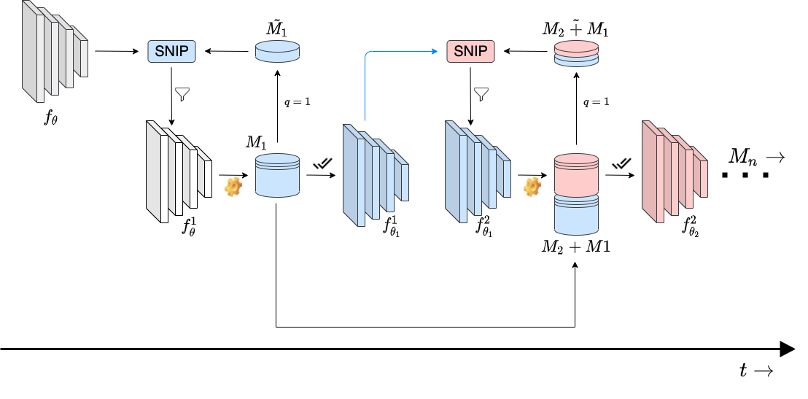

<h1 align="center">APP: Anytime Progressive Pruning</h1>
<p align="center">Diganta Misra<sup>*,1,2,3</sup>, Bharat Runwal<sup>*,2,4</sup>, Tianlong Chen<sup>5</sup>, Zhangyang Wang<sup>5</sup>, Irina Rish<sup>1,3</sup></p>
<p align="center"><sup>1</sup> Mila - Quebec AI Institute,<sup>2</sup> Landskape AI,<sup>3</sup> UdeM,<sup>4</sup> IIT-Delhi,<sup>5</sup> VITA, UT-Austin</p>
<p align="center"><sup>*</sup> Equal Contribution </p>
<p align="center">
  <a href="https://arxiv.org/abs/2204.01640" alt="ArXiv">
        </a>
  <a href="https://www.sparseneural.net/" alt="SNN">
        </a>
  <a href="https://continual-lifelong-learners.github.io/" alt="ACML">
        </a>
  <a href="https://dynn-icml2022.github.io/" alt="Dynn">
        </a>
  <a href="https://slowdnn-workshop.github.io/" alt="Dynn">
        </a>
  <a href="https://wandb.ai/landskape/APP" alt="Dashboard">
        </a>
  <a href="https://landskape.ai/publication/app/" alt="Project">
          </a>
</p>

<p align="center">
  
</p>

### Requirements

To create a new conda environment with the dependencies used in this project, do: 

```
conda env create -f app.yml
```

For running the code on Restricted-Imagenet Dataset, first install the robustness library from [here](https://github.com/landskape-ai/Progressive-Pruning/tree/main/robustness) and provide the imagenet_path argument as the path to the imaganet data folder. 

### Run the Code

Here is an example of running the Anytime Progressive Pruning (APP) on Cifar-10 dataset with 8 megabatches in total:
```
python main_anytime_train.py \
    --data ../data \
    --dataset cifar10 \
    --arch resnet50 \
    --seed 1 \
    --epochs 50 \
    --decreasing_lr 20,40 \
    --batch_size 64 \
    --weight_decay 1e-4 \
    --meta_batch_size 6250 \
    --meta_batch_number 8 \
    --sparsity_level 4.5 \
    --snip_size 0.20 \
    --save_dir c10_r50
```
One-Shot pruning :
```
python main_anytime_one.py \
    --data ../data \
    --dataset cifar10 \
    --arch resnet50 \
    --seed 1 \
    --epochs 50 \
    --decreasing_lr 20,40 \
    --batch_size 64 \
    --weight_decay 1e-4 \
    --meta_batch_size 6250 \
    --meta_batch_number 8 \
    --sparsity_level 4.5 \
    --snip_size 0.20 \
    --save_dir c10_OSP_r18
```
Baseline :
```
python main_anytime_baseline.py \
    --data ../data \
    --dataset cifar10 \
    --arch resnet50 \
    --seed 1 \
    --epochs 50 \
    --decreasing_lr 20,40 \
    --batch_size 64 \
    --weight_decay 1e-4 \
    --meta_batch_size 6250 \
    --meta_batch_number 8 \
    --save_dir c10_BASE_r50
```

## Cite:

```
@misc{misra2022app,
    title={APP: Anytime Progressive Pruning},
    author={Diganta Misra and Bharat Runwal and Tianlong Chen and Zhangyang Wang and Irina Rish},
    year={2022},
    eprint={2204.01640},
    archivePrefix={arXiv},
    primaryClass={cs.LG}
}
```
